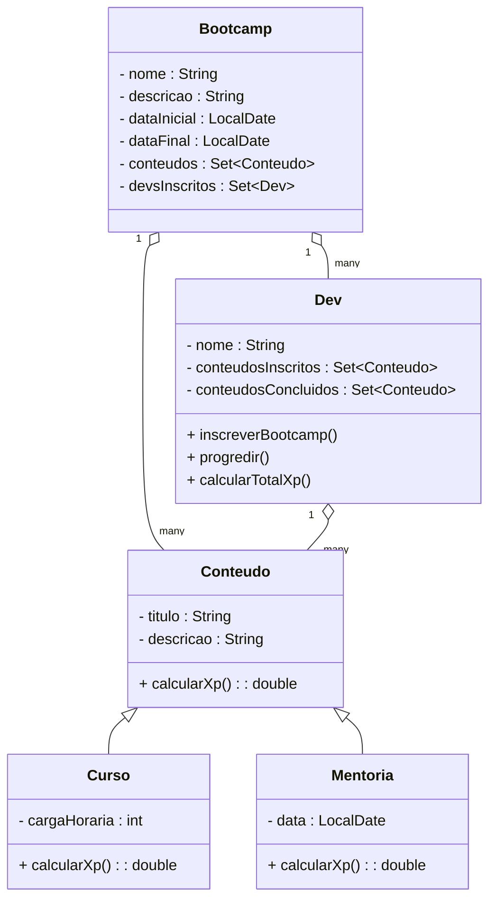

# 💻 Desafio DIO: Abstraindo um Bootcamp Usando Orientação a Objetos em Java

Este projeto faz parte do **Desafio de Projeto da DIO (Digital Innovation One)** e tem como objetivo aplicar os principais pilares da **Programação Orientada a Objetos (POO)** na linguagem **Java**, por meio da abstração do domínio de um Bootcamp educacional.

O desafio está inserido no contexto do bootcamp:

> 🎓 **TONNIE - Java and AI in Europe**

---

## 🚀 Objetivo do Projeto

Modelar o sistema de um bootcamp, com seus cursos, mentorias e desenvolvedores participantes, aplicando os fundamentos da Programação Orientada a Objetos:

- ✅ Abstração  
- ✅ Encapsulamento  
- ✅ Herança  
- ✅ Polimorfismo

---

## 🧠 Conceitos Trabalhados

Durante o desenvolvimento deste projeto, foram aplicados os seguintes conceitos:

| Conceito | Descrição |
|---------|-----------|
| **Abstração** | Criação de classes que representam entidades do domínio (Bootcamp, Curso, Mentoria, Dev). |
| **Encapsulamento** | Controle de acesso aos atributos por meio de modificadores e métodos. |
| **Herança** | Utilização da superclasse `Conteudo` para especialização em `Curso` e `Mentoria`. |
| **Polimorfismo** | Implementação do método `calcularXp()` de forma distinta para cada tipo de conteúdo. |

---

## 🧱 Estrutura de Classes



---

## 📌 Funcionalidades

- Criar cursos e mentorias como tipos de conteúdo educacional.
- Criar e configurar bootcamps com múltiplos conteúdos.
- Inscrever desenvolvedores em bootcamps.
- Simular o progresso do desenvolvedor e calcular sua carga total de XP.
- Praticar modelagem orientada a objetos com reuso e coesão de código.

---

## 📂 Tecnologias Utilizadas

- **Java 17+**
- **JDK (Java Development Kit)**
- IDEs como **IntelliJ IDEA** ou **Eclipse**
- **Paradigma de Programação Orientada a Objetos**

---

## 📎 Como Executar o Projeto

1. Clone este repositório:
   ```bash
   git clone https://github.com/PatrickyLucas/desafio-dio-poo.git
   ```

2. Importe o projeto para sua IDE Java (IntelliJ, Eclipse, VS Code com extensão Java).

3. Compile e execute a classe `Main` localizada no pacote principal.

---

## 👨‍🏫 Autor e Contribuição

Desenvolvido como parte da jornada no bootcamp:

> **TONNIE - Java and AI in Europe**  
> Plataforma: [Digital Innovation One (DIO)](https://www.dio.me/)

Sinta-se livre para abrir *issues*, propor melhorias ou dar um ⭐ no projeto.

---

## 📝 Licença

Este projeto está sob a licença MIT. Consulte o arquivo [LICENSE](LICENSE) para mais informações.
```
